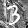

# BNN Verification Instances for the PB25 submission

This dataset consists of pseudo boolean optimization (PBO) and weighted boolean optimization (WBO) instances designed to find minimal perturbation adversarial examples of BNNs (Binarized Neural Networks).
The authors have previously submitted similar instances to the [Max-SAT Evaluation 2020](https://maxsat-evaluations.github.io/2020/) [1] and MIPLIB 2024; this dataset is their pseudo-boolean version for [Pseudo-Boolean Competition 2025](https://www.cril.univ-artois.fr/PB25/). Detailed information including source code is available at <https://github.com/msakai/bnn-verification/>.

## Problem Overview

Given a trained neural network f and an input x⁰, the objective is to find the minimal perturbation ε such that x⁰ + ε is misclassified. This can be formulated as the following optimization problem:

```
minimize ǁεǁ
subject to f(x⁰ + ε) ≠ f(x⁰)
```

In this dataset, the task of neural networks is hand-written digit classification. The input space of f comprises 8-bit images of size 28×28 (784 pixels in total), and the output space is {0, …, 9}.

```
f: {0,…,255}⁷⁸⁴ → {0,…,9}
```

## Target Neural Networks

The network architecture is based on Binarized Neural Networks (BNNs) [2][3]. Though we don't explain details about BNN, our BNN consists of the following steps:
1. Each pixel xᵢ ∈ {0, …, 255} is binarized to zᵢ = binᵢ(xᵢ) ∈ {-1, +1} using learned threshold which varies depending on location i.
2. A function g is applied to z = (zᵢ)ᵢ to produce logits = g(z) ∈ R¹⁰,
3. Finally, the output y is given by y = argmaxⱼ logitsⱼ.

Thus, f = argmax ∘ g ∘ bin.

We trained the BNNs on three datasets: [MNIST](https://yann.lecun.com/exdb/mnist/) and its two variants [MNIST-rot and MNIST-back-image](http://web.archive.org/web/20180831072509/http://www.iro.umontreal.ca/~lisa/twiki/bin/view.cgi/Public/MnistVariations).

## Objective Functions

We consider four norms —L₀, L₁, L₂, and L<sub>∞</sub>— of ε  as objective functions. While only L<sub>∞</sub> instances were submitted to the Max-SAT Evaluation 2020, this dataset includes instances for L₀, L₁, L₂ norms as well.

## Problem Instances

The dataset uses five images that were used in the instances selected for the Max-SAT Evaluation 2020. These images are presented in the following table:

|Dataset|Instance No.|Image|True Label|
|-|-:|-|-:|
|MNIST|7||9|
|MNIST-rot|8||1|
|MNIST-rot|16||5|
|MNIST-back-image|32||3|
|MNIST-back-image|73||5|

Combining these five images with four norm types results in a total of 20 instances.

The filenames of the problem instances follow this format:

```
bnn_{dataset_name}_{instance no}_label{true label}_adversarial_norm_{norm's p}.opb
bnn_{dataset_name}_{instance no}_label{true label}_adversarial_norm_{norm's p}.wbo
```

## Notes on pseudo-boolean encoding

### Decision Variables

We use z = (zᵢ)ᵢ as decision variables instead of εᵢs and they are encoded as `x1` to `x784` in the problem files.

Conversely, we define wᵢ to be the smallest magnitude ε such that binᵢ(x⁰ᵢ + ε) ≠ binᵢ(x⁰ᵢ). We define dᵢ as zᵢ if binᵢ(x⁰ᵢ)=-1 and as (1 - zᵢ) if binᵢ(x⁰ᵢ)=+1. Then εᵢ can be recovered as wᵢ dᵢ.

### Output Variables

One hot encoding of f(x⁰ + ε) ∈ {0,…,9} is represented as `x785` to `x794` in the problem files.

### Objective Functions

For a Lₚ-norm case with p ≠ ∞, minimizing ǁεǁₚ is equivalent to minimizing ǁεǁₚᵖ = ∑ᵢ |εᵢ|ᵖ = ∑ᵢ |wᵢ|ᵖ dᵢ. The last expression serves as the objective function in our PB/WBO encoding.

For the L<sub>∞</sub>-norm case, the objective function is ǁεǁ<sub>∞</sub> = maxᵢ |εᵢ| = maxᵢ |wᵢ| dᵢ. Let A = {a₁ < … < a<sub>|A|</sub>} = {|wᵢ|}ᵢ be the set of **distinct** absolute weight values in ascending order. For each a<sub>k</sub> ∈ A, introduce a boolean variable r<sub>k</sub> (*relaxation variable*). Then, the objective function can be minimized under the following constraints:

- A unit soft clause (¬r<sub>k</sub>) with a weight a<sub>k</sub> - a<sub>k-1</sub>, where a<sub>0</sub> is treated as 0,
- Relaxation variables are downward closed: (r<sub>k</sub> → r<sub>k-1</sub>) for each k > 0,
- Each d<sub>i</sub> can be true only if the corresponding relaxation variable is true: (d<sub>i</sub> → r<sub>k</sub>), where w<sub>i</sub> = a<sub>k</sub>.

### Problem Size

The following table presents problem size comparison in the case of MNIST no. 7 and L<sub>∞</sub> norm.

| | #Variables | #Constraints | Filesize |
|-|-:|-:|-:|
| Max-SAT encoding using Totalizer for cardinality constraints | 1,824,676 | 132,670,200 | 3.61 GiB (.wcnf file) |
| PB encoding | 1,447 | 2,026 | 3.06 MiB (.opb file) |
| WBO encoding | 1,447 | 2,181 | 3.06 MiB (.wbo file) |
| MILP encoding | 1,295 | 1,876 | 6.14 MiB (.lp file) |

## References

* [1] M. Sakai, “BNN verification dataset for Max-SAT Evaluation 2020,”
  In MaxSAT Evaluation 2020: Solver and Benchmark Descriptions. 2020,
  pp. 37-28. [Online]. Available: <http://hdl.handle.net/10138/318451>
* [2] I. Hubara, M. Courbariaux, D. Soudry, R. El-Yaniv, and Y. Bengio, “Binarized neural networks,” in Advances in Neural Information Processing Systems 29, D. D. Lee, M. Sugiyama, U. V. Luxburg, I. Guyon, and R. Garnett, Eds. Curran Associates, Inc., 2016, pp. 4107–4115. [Online]. Available: <http://papers.nips.cc/paper/6573-binarized-neural-networks.pdf>
* [3] N. Narodytska, S. P. Kasiviswanathan, L. Ryzhyk, M. Sagiv, and T. Walsh, “Verifying properties of binarized deep neural networks,” in Proceedings of the Thirty-Second AAAI Conference on Artificial Intelligence, (AAAI-18), the 30th innovative Applications of Artificial Intelligence (IAAI-18), and the 8th AAAI Symposium on Educational Advances in Artificial Intelligence (EAAI-18), New Orleans, Louisiana, USA, February 2-7, 2018, S. A. McIlraith and K. Q. Weinberger, Eds. AAAI Press, 2018, pp. 6615–6624. [Online]. Available: <https://www.aaai.org/ocs/index.php/AAAI/AAAI18/paper/view/16898>
