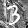
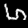

# BNN verification dataset for Max-SAT Evaluation 2020

## Usage

(TBD)

## Example

This is the case for `bnn_mnist_rot_10_label4_adversarial_norm_inf_totalizer.wcnf`.

| | Image | Prediction of a model | P(y=0) (logit) | P(y=1) (logit) | P(y=2) (logit) | P(y=3) (logit) | P(y=4) (logit) | P(y=5) (logit) | P(y=6) (logit) | P(y=7) (logit) | P(y=8) (logit) | P(y=9) (logit) |
|-|-|-|-|-|-|-|-|-|-|-|-|-|
| Original image |  | 4 | 3.1416737e-14 (8.883254) | 5.5133663e-22 (-8.975005) | 1.2148612e-05 (28.656395) | 7.593513e-20 (-4.049718) | **0.9997013** (**39.974392**) | 1.711211e-12 (12.88087) | 3.8705436e-10 (18.302235) | 0.00028651825 (31.816982) | 5.633235e-12 (14.072353) | 4.0916482e-11 (16.055202) |
| Perturbated image |  | 6 | 4.5545687e-10 (12.883254) | 2.6813108e-21 (-12.975005) | 0.0032257813 (28.656395) | 1.7916893e-10 (11.950282) | 0.0016309624 (27.97439) | 0.004037595 (28.880869) | **0.91325474** (**34.302235**) | 0.07607825 (31.816982) | 4.4588405e-06 (22.072353) | 0.0017682364 (28.055202) |

Added perturbation:

* L0-norm: 18.0
* L1-norm: 18.0
* L2-norm: 4.242640687119285
* L∞-norm: 1.0

## Submission to Max-SAT evaluation 2020

* [Description](maxsat2020/description.pdf)
* [Submitted instances](https://www.dropbox.com/s/s5r30rcpfby1vmd/maxsat2020_bnn_verification.tar.gz?dl=0) (29.62 GB)
 
## Result in the Max-SAT Evaluation 2020

[The competition results and organizer's slides](https://maxsat-evaluations.github.io/2020/rankings.html) are available on the competition website.

Among submitted 60 instance, 5 instances ([maxsat2020_bnn_verification_used.tar.gz](https://www.dropbox.com/scl/fi/o5iseq0pm4ynsi3oq5d2m/maxsat2020_bnn_verification_used.tar.gz?rlkey=brvvfdxs0v4o56f9vo29bvskk&dl=0), 2.5 GB) were used in the competition:

|Instance|Image|Label|Minimum ǁτǁ∞|
|-|-|-:|-:|
|bnn_mnist_7_label9_adversarial_norm_inf_totalizer.wcnf.gz||9|1|
|bnn_mnist_back_image_32_label3_adversarial_norm_inf_totalizer.wcnf.gz||3|2|
|bnn_mnist_rot_16_label5_adversarial_norm_inf_totalizer.wcnf.gz||5|1|
|bnn_mnist_rot_8_label1_adversarial_norm_inf_totalizer.wcnf.gz||1|1|
|bnn_mnist_back_image_73_label5_adversarial_norm_inf_totalizer.wcnf.gz||5|4|

Solving time (in seconds; 3600.0 means timeout):

|Instance|maxino-pref|maxino|Pacose|UWrMaxSat|MaxHS|QMaxSAT|RC2-B / RC2-A / smax-minisat / smax-mergesat|
|-|-:|-:|-:|-:|-:|-:|-:|
|…|270.62|269.06|402.17|648.45|991.52|141.42|3600.0|
|…|279.84|277.76|1101.24|795.81|1733.77|1729.06|3600.0|
|…|367.28|367.06|221.87|657.69|1006.6|704.83|3600.0|
|…|84.87|84.06|347.71|588.25|1083.57|3600.0|3600.0|
|…|2215.51|2232.61|3600.0|3600.0|3600.0|3600.0|3600.0|

## Talk at NII Shonan Meeting No. 180 “The Art of SAT”

* [Program](https://nikolajbjorner.github.io/ShonanArtOfSAT/program.html)
* [Slides](https://nikolajbjorner.github.io/ShonanArtOfSAT/MasahiroSakai-slides.pdf)

### Some follow-ups

* Q: In several samples used in the contest, the images do not look like the numbers shown as their labels.
  * A: This problem was caused by my misunderstanding of the order of the features in `MNIST-rot` and `MNIST-back-image` datasets (`MNIST` does not have this problem). Thereby images were rotated and flipped from their original form. The features should have been reordered in the preprocessing during dataset creation. However, this is a visualization-only issue, since training and inference treat data in a consistent manner.
* Q: What happens if two classes have the same maximum logit value?
  * A: It is common to return a class with the smallest index in actual implementations (e.g. [numpy.argmax](https://numpy.org/doc/stable/reference/generated/numpy.argmax.html) and [torch.argmax](https://pytorch.org/docs/stable/generated/torch.argmax.html)). However, safety property relying on such an assumption is not robust (in particular in the case of floating point numbers). Therefore, we didn't specify which of the maximum-logit classes is chosen and allowed one of them to be chosen non-determinically, in a way similar to how unspecified behavior is modeled with non-determinism in model checking safety properties. In other words, we are checking whether it is possible for an incorrect class to have a logit value at least as large as the one for the correct class.
* Q: Are there images of successfully perturbated cases?
  * A: I added an example above, although it is not the one used in the competition.
* Q: You said that using *sequential counters* produced a much larger file than using the *totalizer*. However, their sizes should be close both theoretically and empirically.
  * A: Since I didn't keep the results of experiments with *sequential counters*, I re-run the experiment using the sequential counter.
    The result for the 7th data in the MNIST test dataset (label = 9) in the case of L∞ norm is as follows:
    |encoding|file size (uncompressed file)|#variables|#constraints|Download|
    |-|-:|-:|-:|-|
    |sequential counters|5,076,826,688 B|64,168,245|192,424,087|[bnn_mnist_7_label9_adversarial_norm_inf_sequential.wcnf.zst](https://www.dropbox.com/scl/fo/8ppww4gw2ulcxci9lakzu/h/problem_size_comparison?dl=0&preview=bnn_mnist_7_label9_adversarial_norm_inf_sequential.wcnf.zst&rlkey=xm0xobzf1lu1qbv3h5plsv9ds&subfolder_nav_tracking=1)|
    |totalizer|3,871,189,890 B|1,824,676|132,670,200|[bnn_mnist_7_label9_adversarial_norm_inf_totalizer.wcnf.zst](https://www.dropbox.com/scl/fo/8ppww4gw2ulcxci9lakzu/h/problem_size_comparison?dl=0&preview=bnn_mnist_7_label9_adversarial_norm_inf_totalizer.wcnf.zst&rlkey=xm0xobzf1lu1qbv3h5plsv9ds&subfolder_nav_tracking=1)|
    |parallel counters|94,898,008 B|516,006|3,227,479|[bnn_mnist_7_label9_adversarial_norm_inf_parallel.wcnf.zst](https://www.dropbox.com/scl/fo/8ppww4gw2ulcxci9lakzu/h/problem_size_comparison?dl=0&preview=bnn_mnist_7_label9_adversarial_norm_inf_parallel.wcnf.zst&rlkey=xm0xobzf1lu1qbv3h5plsv9ds&subfolder_nav_tracking=1)|
    |(PB constraints in WBO file)|3,215,049 B|1,452|2,191|[bnn_mnist_7_label9_adversarial_norm_inf.wbo.zst](https://www.dropbox.com/scl/fo/8ppww4gw2ulcxci9lakzu/h/problem_size_comparison?dl=0&preview=bnn_mnist_7_label9_adversarial_norm_inf.wbo.zst&rlkey=xm0xobzf1lu1qbv3h5plsv9ds&subfolder_nav_tracking=1)|

    The file size and the number of constraints are certainly larger in the *sequential counters* case, but the difference is not that much
    (although there is a huge difference in the number of variables).
    Therefore, it appears that I misremembered the results.
    

## References

* [MaxSAT Evaluation 2020 : Solver and Benchmark Descriptions](https://helda.helsinki.fi/items/a24cd636-edb1-4e20-bbdf-e56a66a3a05c)
