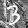

# BNN Verification Instances for the MIPLIB 2024 submission

## Submitted files

- [instances.20250217/](instances.20250217/) directory contains a version of problem instances submitted on 2025-02-17
- [instances.20241102/](instances.20241102/) directory contains a version of problem instances submitted on 2024-11-02
- [instances.20241030/](instances.20241030/) directory contains a version of problem instances submitted on 2024-10-30
- [additional_files/](additional_files/) directory contains documents and known solutions

## Solutions

Some of them were found after the submissions.

|Problem instance|Solution|Image|Predicted Label|Objective Value|
|-|-|-|-:|-:|
|MNIST No. 7|-||9|-|
|[bnn_mnist_7_label9_adversarial_norm_0](instances.20250217/bnn_mnist_7_label9_adversarial_norm_0.lp.bz2)|[solution](solutions/bnn_mnist_7_label9_adversarial_norm_0.sol)||4|4|
|[bnn_mnist_7_label9_adversarial_norm_1](instances.20250217/bnn_mnist_7_label9_adversarial_norm_1.lp.bz2)|[solution](solutions/bnn_mnist_7_label9_adversarial_norm_1.sol)||4|5|
|[bnn_mnist_7_label9_adversarial_norm_2](instances.20250217/bnn_mnist_7_label9_adversarial_norm_2.lp.bz2)|[solution](solutions/bnn_mnist_7_label9_adversarial_norm_2.sol)||4|5|
|[bnn_mnist_7_label9_adversarial_norm_inf](instances.20250217/bnn_mnist_7_label9_adversarial_norm_inf.lp.bz2)|[solution](solutions/bnn_mnist_7_label9_adversarial_norm_inf.sol)||5|1|
|MNIST-rot No. 8|-||1|-|
|[bnn_mnist_rot_8_label1_adversarial_norm_0](instances.20250217/bnn_mnist_rot_8_label1_adversarial_norm_0.lp.bz2)|[solution](solutions/bnn_mnist_rot_8_label1_adversarial_norm_0.sol)||0|3|
|[bnn_mnist_rot_8_label1_adversarial_norm_1](instances.20250217/bnn_mnist_rot_8_label1_adversarial_norm_1.lp.bz2)|[solution](solutions/bnn_mnist_rot_8_label1_adversarial_norm_1.sol)||0|3|
|[bnn_mnist_rot_8_label1_adversarial_norm_2](instances.20250217/bnn_mnist_rot_8_label1_adversarial_norm_2.lp.bz2)|[solution](solutions/bnn_mnist_rot_8_label1_adversarial_norm_2.sol)||0|3|
|[bnn_mnist_rot_8_label1_adversarial_norm_inf](instances.20250217/bnn_mnist_rot_8_label1_adversarial_norm_inf.lp.bz2)|[solution](solutions/bnn_mnist_rot_8_label1_adversarial_norm_inf.sol)||3|1|
|MNIST-rot No. 16|-||5|-|
|[bnn_mnist_rot_16_label5_adversarial_norm_0](instances.20250217/bnn_mnist_rot_16_label5_adversarial_norm_0.lp.bz2)|[solution](solutions/bnn_mnist_rot_16_label5_adversarial_norm_0.sol)||4|2|
|[bnn_mnist_rot_16_label5_adversarial_norm_1](instances.20250217/bnn_mnist_rot_16_label5_adversarial_norm_1.lp.bz2)|[solution](solutions/bnn_mnist_rot_16_label5_adversarial_norm_1.sol)||4|2|
|[bnn_mnist_rot_16_label5_adversarial_norm_2](instances.20250217/bnn_mnist_rot_16_label5_adversarial_norm_2.lp.bz2)|[solution](solutions/bnn_mnist_rot_16_label5_adversarial_norm_2.sol)||4|2|
|[bnn_mnist_rot_16_label5_adversarial_norm_inf](instances.20250217/bnn_mnist_rot_16_label5_adversarial_norm_inf.lp.bz2)|[solution](solutions/bnn_mnist_rot_16_label5_adversarial_norm_inf.sol)||7|1|
|MNIST-back-image No. 32|-||3|-|
|[bnn_mnist_back_image_32_label3_adversarial_norm_0](instances.20250217/bnn_mnist_back_image_32_label3_adversarial_norm_0.lp.bz2)|[solution](solutions/bnn_mnist_back_image_32_label3_adversarial_norm_0.sol)||8|2|
|[bnn_mnist_back_image_32_label3_adversarial_norm_1](instances.20250217/bnn_mnist_back_image_32_label3_adversarial_norm_1.lp.bz2)|[solution](solutions/bnn_mnist_back_image_32_label3_adversarial_norm_1.sol)||5|4|
|[bnn_mnist_back_image_32_label3_adversarial_norm_2](instances.20250217/bnn_mnist_back_image_32_label3_adversarial_norm_2.lp.bz2)|[solution](solutions/bnn_mnist_back_image_32_label3_adversarial_norm_2.sol)||8|7|
|[bnn_mnist_back_image_32_label3_adversarial_norm_inf](instances.20250217/bnn_mnist_rot_8_label1_adversarial_norm_inf.lp.bz2)|[solution](solutions/bnn_mnist_back_image_32_label3_adversarial_norm_inf.sol)||8|2|
|MNIST-back-image No. 73 |-||5|-|
|[bnn_mnist_back_image_73_label5_adversarial_norm_0](instances.20250217/bnn_mnist_back_image_73_label5_adversarial_norm_0.lp.bz2)|[solution](solutions/bnn_mnist_back_image_73_label5_adversarial_norm_0.sol)||3|2|
|[bnn_mnist_back_image_73_label5_adversarial_norm_1](instances.20250217/bnn_mnist_back_image_73_label5_adversarial_norm_1.lp.bz2)|[solution](solutions/bnn_mnist_back_image_73_label5_adversarial_norm_1.sol)||3|9|
|[bnn_mnist_back_image_73_label5_adversarial_norm_2](instances.20250217/bnn_mnist_back_image_73_label5_adversarial_norm_2.lp.bz2)|[solution](solutions/bnn_mnist_back_image_73_label5_adversarial_norm_2.sol)||3|27|
|[bnn_mnist_back_image_73_label5_adversarial_norm_inf](instances.20250217/bnn_mnist_rot_8_label1_adversarial_norm_inf.lp.bz2)|[solution](solutions/bnn_mnist_back_image_73_label5_adversarial_norm_inf.sol)||3|4|
