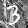

# BNN Verification Instances for the MIPLIB 2024 submission

This dataset consists of MILP instances designed to find minimal perturbation adversarial examples of BNNs (Binarized Neural Networks).

The authors have previously submitted similar instances to the [Max-SAT Evaluation 2020](https://maxsat-evaluations.github.io/2020/) [1]; this dataset is its MILP version. Detailed information including source code is available at <https://github.com/msakai/bnn-verification/>.

## Problem Overview

Given a trained neural network f and an input x⁰, the objective is to find the minimal perturbation ε such that x⁰ + ε is misclassified. This can be formulated as the following optimization problem:

```
minimize ǁεǁ
subject to f(x⁰ + ε) ≠ f(x⁰)
```

In this dataset, the task of neural networks is hand-written digit classification. The input space of f comprises 8-bit images of size 28×28 (784 pixels in total), and the output space is {0, …, 9}.

```
f: {0,…,255}⁷⁸⁴ → {0,…,9}
```

## Target Neural Networks

The network architecture is based on Binarized Neural Networks (BNNs) [2][3]. Through detailed explanations of BNN are omitted, our BNN consists of the following steps:

1. Each pixel xᵢ ∈ {0, …, 255} is binarized to zᵢ = binᵢ(xᵢ) ∈ {-1, +1} using learned threshold which varies depending on i.
2. A function g is applied to z = (zᵢ)ᵢ to produce logits = g(z) ∈ R¹⁰,
3. Finally, the output y is given by y = argmaxⱼ logitsⱼ.

Thus, f = argmax ∘ g ∘ bin.

We trained the BNNs on three datasets: [MNIST](https://yann.lecun.com/exdb/mnist/) and its two variants, [MNIST-rot and MNIST-back-image](http://web.archive.org/web/20180831072509/http://www.iro.umontreal.ca/~lisa/twiki/bin/view.cgi/Public/MnistVariations).

## Objective Functions

We consider four norms —L₀, L₁, L₂, and L<sub>∞</sub>— of ε  as objective functions. While only L<sub>∞</sub> instances were submitted to the Max-SAT Evaluation 2020, this dataset includes instances for L₀, L₁, L₂ norms as well.

## Problem Instances

The dataset uses five images that were used in the instances selected for the Max-SAT Evaluation 2020. These images are presented in the following table:

|Dataset|Instance No.|Image|True Label|
|-|-:|-|-:|
|MNIST|7||9|
|MNIST-rot|8||1|
|MNIST-rot|16||5|
|MNIST-back-image|32||3|
|MNIST-back-image|73||5|

Combining these five images with four norm types results in a total of 20 instances.

The filenames of the problem instances follow this format:

```
bnn_{dataset_name}_{instance no}_label{true label}_adversarial_norm_{norm's p}.lp
```

## Notes on MILP encoding

### Decision Variables

We use input\_bin(0), …, input\_bin(783) as decision variables instead of εᵢs.

Each input\_bin(i) corresponds to (binᵢ(x⁰ᵢ + εᵢ) + 1) / 2.

Conversely, we define wᵢ to be the smallest magnitude v such that binᵢ(x⁰ᵢ + v) ≠ binᵢ(x⁰ᵢ). We define dᵢ as input\_bin(i) if binᵢ(x⁰ᵢ)=-1 and as (1 - input\_bin(i)) if binᵢ(x⁰ᵢ)=+1. Then εᵢ can be recovered as wᵢ dᵢ.

### Output Variables

The variables output(0), …, output(9) represents a one hot encoding of f(x⁰ + ε) ∈ {0,…,9}.

### Objective Functions

For L<sub>∞</sub>-norm, the objective function is ǁεǁ<sub>∞</sub> = max {|εᵢ|}ᵢ = max {|wᵢ| dᵢ}ᵢ. This is minimized by introducing a fresh variable top, adding constraints |wᵢ| dᵢ ≤ top for all i, and minimizing top. (In Max-SAT, we used a more complex encoding, but here we use the standard technique for handling max in MILP.)

For Lₚ-norm with p ≠ ∞, minimizing ǁεǁₚ is equivalent to minimizing ǁεǁₚᵖ = ∑ᵢ |εᵢ|ᵖ = ∑ᵢ |wᵢ|ᵖ dᵢ. The last expression serves as the objective function in our MILP encoding.

## Known Solutions

For instances with the L<sub>∞</sub>-norm, optimal solutions are known:

|Problem instance|Solution| ǁεǁ<sub>∞</sub>|Original Image|Predicted Label|Perturbated Image|Predicted Label|
|-|-|-:|-|-:|-|-:|
|bnn_mnist_7_label9_adversarial_norm_inf.lp|[solution](solutions/bnn_mnist_7_label9_adversarial_norm_inf.sol)|1||9||5|
|bnn_mnist_rot_8_label1_adversarial_norm_inf.lp|[soltuion](solutions/bnn_mnist_rot_8_label1_adversarial_norm_inf.sol)|1||1||3|
|bnn_mnist_rot_16_label5_adversarial_norm_inf.lp|[soltuion](solutions/bnn_mnist_rot_16_label5_adversarial_norm_inf.sol)|1||5||7|
|bnn_mnist_back_image_32_label3_adversarial_norm_inf.lp|[soltuion](solutions/bnn_mnist_back_image_32_label3_adversarial_norm_inf.sol)|2||3||8|
|bnn_mnist_back_image_73_label5_adversarial_norm_inf.lp|[soltuion](solutions/bnn_mnist_back_image_73_label5_adversarial_norm_inf.sol)|4||5||3|

Optimal solutions for instances with other norm types are currently unknown.

## References

* [1] M. Sakai, “BNN verification dataset for Max-SAT Evaluation 2020,”
  In MaxSAT Evaluation 2020: Solver and Benchmark Descriptions. 2020,
  pp. 37-28. [Online]. Available: <http://hdl.handle.net/10138/318451>
* [2] I. Hubara, M. Courbariaux, D. Soudry, R. El-Yaniv, and Y. Bengio, “Binarized neural networks,” in Advances in Neural Information Processing Systems 29, D. D. Lee, M. Sugiyama, U. V. Luxburg, I. Guyon, and R. Garnett, Eds. Curran Associates, Inc., 2016, pp. 4107–4115. [Online]. Available: <http://papers.nips.cc/paper/6573-binarized-neural-networks.pdf>
* [3] N. Narodytska, S. P. Kasiviswanathan, L. Ryzhyk, M. Sagiv, and T. Walsh, “Verifying properties of binarized deep neural networks,” in Proceedings of the Thirty-Second AAAI Conference on Artificial Intelligence, (AAAI-18), the 30th innovative Applications of Artificial Intelligence (IAAI-18), and the 8th AAAI Symposium on Educational Advances in Artificial Intelligence (EAAI-18), New Orleans, Louisiana, USA, February 2-7, 2018, S. A. McIlraith and K. Q. Weinberger, Eds. AAAI Press, 2018, pp. 6615–6624. [Online]. Available: <https://www.aaai.org/ocs/index.php/AAAI/AAAI18/paper/view/16898>
